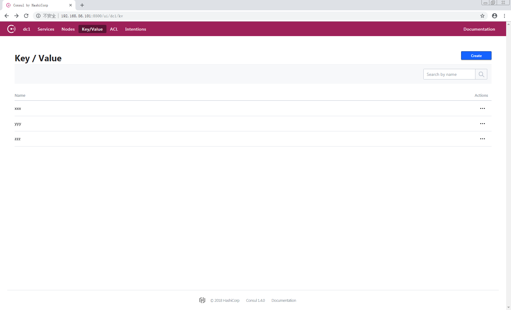

> centos上通过centos基础镜像搭建consul集群

<!-- more -->

#### docker相关命令
```
获取dockerhub镜像(不带版本拉取lastest)
docker pull centos:<version>

创建docker镜像
docker build -t mydocker:0.1 .

查看当前镜像
docker image ls

运行容器
docker run -it -d --privileged=true -p 8501:8500 mydocker:0.1 /usr/sbin/init

查看容器
docker ps -a
```

#### 安装docker-ce
根据系统版本选择合适的docker-ce版本，最新的docker-ce版本可能不适配老的centos版本。

查看docker-ce可用版本：

```
[root@localhost ~]# yum list docker-ce --showduplicates | sort -r
已加载插件：fastestmirror
已安装的软件包
可安装的软件包
 * updates: mirrors.cqu.edu.cn
Loading mirror speeds from cached hostfile
 * extras: mirror.bit.edu.cn
docker-ce.x86_64            3:18.09.0-3.el7                    docker-ce-stable
docker-ce.x86_64            3:18.09.0-3.el7                    @docker-ce-stable
docker-ce.x86_64            18.06.1.ce-3.el7                   docker-ce-stable
docker-ce.x86_64            18.06.0.ce-3.el7                   docker-ce-stable
docker-ce.x86_64            18.03.1.ce-1.el7.centos            docker-ce-stable
docker-ce.x86_64            18.03.0.ce-1.el7.centos            docker-ce-stable
docker-ce.x86_64            17.12.1.ce-1.el7.centos            docker-ce-stable
docker-ce.x86_64            17.12.0.ce-1.el7.centos            docker-ce-stable
docker-ce.x86_64            17.09.1.ce-1.el7.centos            docker-ce-stable
docker-ce.x86_64            17.09.0.ce-1.el7.centos            docker-ce-stable
docker-ce.x86_64            17.06.2.ce-1.el7.centos            docker-ce-stable
docker-ce.x86_64            17.06.1.ce-1.el7.centos            docker-ce-stable
docker-ce.x86_64            17.06.0.ce-1.el7.centos            docker-ce-stable
docker-ce.x86_64            17.03.3.ce-1.el7                   docker-ce-stable
docker-ce.x86_64            17.03.2.ce-1.el7.centos            docker-ce-stable
docker-ce.x86_64            17.03.1.ce-1.el7.centos            docker-ce-stable
docker-ce.x86_64            17.03.0.ce-1.el7.centos            docker-ce-stable
 * base: mirrors.cqu.edu.cn
```

安装docker-ce：

```
yum install docker-ce
```

启动docker：

```
systemctl start docker
```

设置开机启动：

```
systemctl enable docker
```

> 参考：<[Get Docker CE for CentOS \| Docker Documentation](https://docs.docker.com/install/linux/docker-ce/centos/)>

#### Dockerfile
base Dockerfile 根据centos镜像安装基础软件制作基础镜像:

```
FROM centos

RUN mkdir -p /etc/yum.repos.d/repo.bak/ && \
    mv /etc/yum.repos.d/*.repo /etc/yum.repos.d/repo.bak/

COPY repo/CentOS7-Base-163.repo /etc/yum.repos.d/
COPY repo/Centos-7.repo /etc/yum.repos.d/

RUN yum clean all && \
    yum makecache && \
    yum install -y epel-release

COPY repo/epel-7.repo /etc/yum.repos.d/

RUN yum clean all && \
    yum makecache

RUN yum install -y net-tools &&\ 
    yum install -y iproute && \
    yum install -y unzip && \
    yum install -y vim

COPY conf/.vimrc /root/
RUN alias vi=vim
```

> 参考：[CentOS7系统配置国内yum源和epel源](https://www.cnblogs.com/renpingsheng/p/7845096.html)

根据定制的基础镜像安装业务镜像：

```
FROM mybase:0.1

COPY pkg/consul_1.4.0_linux_amd64.zip /home

RUN cd /home && \
    unzip /home/consul_1.4.0_linux_amd64.zip && \
    mv /home/consul /usr/local/bin

COPY pkg/start.sh /home

COPY pkg/test_consul.service /usr/lib/systemd/system/

RUN chmod 644 /usr/lib/systemd/system/test_consul.service && \
    systemctl enable test_consul.service

EXPOSE 8500

CMD ["/usr/sbin/init"]
```

> 参考：[Centos7下Rinetd安装与应用](https://www.cnblogs.com/zhenyuyaodidiao/p/5540209.html), [linux rinetd 端口转发部署](https://blog.csdn.net/a9529lty/article/details/54906267?locationNum=8&fps=1)

#### 安装并自动运行consul
配置systemctl系统服务

```
[UNIT]
Description=Test Consul

[Service]
Type=oneshot
RemainAfterExit=true
ExecStart=/bin/bash /home/start.sh
KillMode=process

[Install]
WantedBy=multi-user.target
```

启动脚本

```
#!/bin/bash

local_ip=$(ifconfig | grep -oP "172.17.0.\d{0,3}")
consul agent -server -bootstrap-expect=3 -data-dir=/tmp/consul -node=${local_ip} -bind=${local_ip} -datacenter=dc1 -client=0.0.0.0 -ui >> /home/start.log 2>&1 &
sleep 20
consul join ${local_ip}
```

查看consul集群

```
[root@localhost ~]# docker ps -a
CONTAINER ID        IMAGE               COMMAND             CREATED             STATUS              PORTS                    NAMES
9bb07c7d4b3a        mydocker:1.0        "/usr/sbin/init"    3 days ago          Up 3 minutes        0.0.0.0:8502->8500/tcp   consul_0.2
caca6a79a152        mydocker:1.0        "/usr/sbin/init"    3 days ago          Up 3 minutes        0.0.0.0:8501->8500/tcp   consul_0.3
70e3e2f90afb        mydocker:1.0        "/usr/sbin/init"    3 days ago          Up 3 minutes        0.0.0.0:8500->8500/tcp   consul_0.4
```

consul UI



#### 使用docker-compose编排容器

安装dockercompose

```
[root@localhost ~]# curl -L "https://github.com/docker/compose/releases/download/1.23.1/docker-compose-$(uname -s)-$(uname -m)" -o /usr/local/bin/docker-compose

[root@localhost ~]# chmod +x /usr/local/bin/docker-compose

[root@localhost ~]# docker-compose --version
docker-compose version 1.23.2, build 1110ad01
```

参考：[Install Docker Compose \| Docker Documentation](https://docs.docker.com/compose/install/)

根据场景编写docker-compose.yml

```
version: '3'
services:
    consul_1:
        image: mydocker:1.0
        container_name: docker_consul_1
        hostname: consul_1
        environment:
            - TZ=Asia/Shanghai
        ports:
            - 8501:8500
        privileged: true
        tty: true
        command: /usr/sbin/init

    consul_2:
        image: mydocker:1.0
        container_name: docker_consul_2
        hostname: consul_2
        environment:
            - TZ=Asia/Shanghai
        ports:
            - 8502:8500
        privileged: true
        tty: true
        command: /usr/sbin/init

    consul_3:
        image: mydocker:1.0
        container_name: docker_consul_3
        hostname: consul_3
        environment:
            - TZ=Asia/Shanghai
        ports:
            - 8503:8500
        privileged: true
        tty: true
        command: /usr/sbin/init
```

启动容器

```
[root@localhost compose_consul]# docker-compose up -d
Creating network "compose_consul_default" with the default driver
Creating docker_consul_2 ... done
Creating docker_consul_1 ... done
Creating docker_consul_3 ... done
```

停止并删除容器

```
[root@localhost compose_consul]# docker-compose down
Stopping docker_consul_1 ... done
Stopping docker_consul_2 ... done
Stopping docker_consul_3 ... done
Removing docker_consul_1 ... done
Removing docker_consul_2 ... done
Removing docker_consul_3 ... done
Removing network compose_consul_default
```

查看

```
[root@localhost compose_consul]# docker-compose ps
     Name            Command       State           Ports
-----------------------------------------------------------------
docker_consul_1   /usr/sbin/init   Up      0.0.0.0:8501->8500/tcp
docker_consul_2   /usr/sbin/init   Up      0.0.0.0:8502->8500/tcp
docker_consul_3   /usr/sbin/init   Up      0.0.0.0:8503->8500/tcp
```

